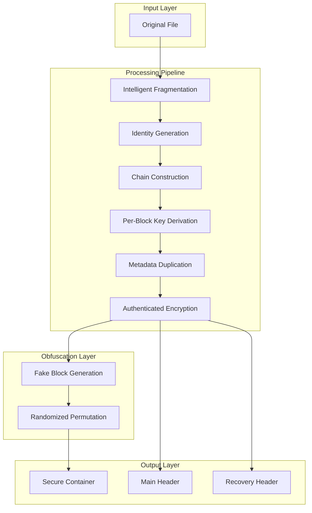
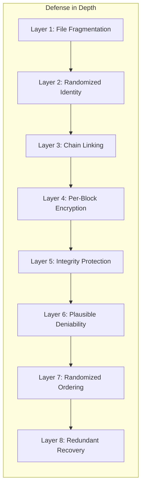
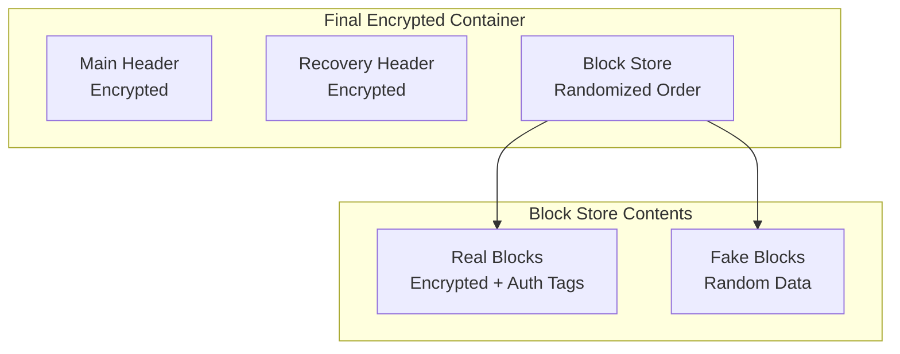
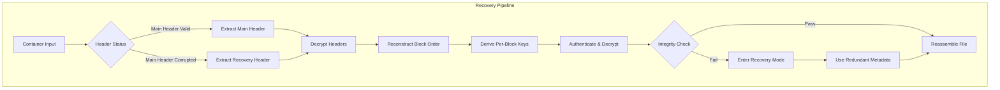
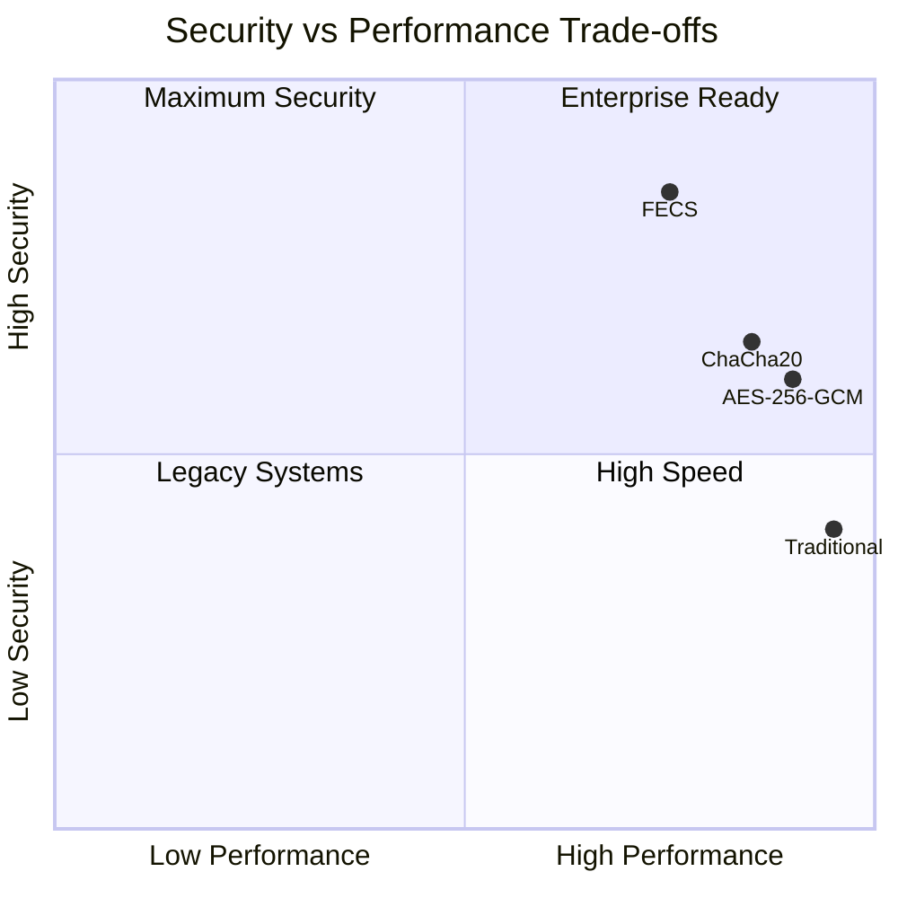
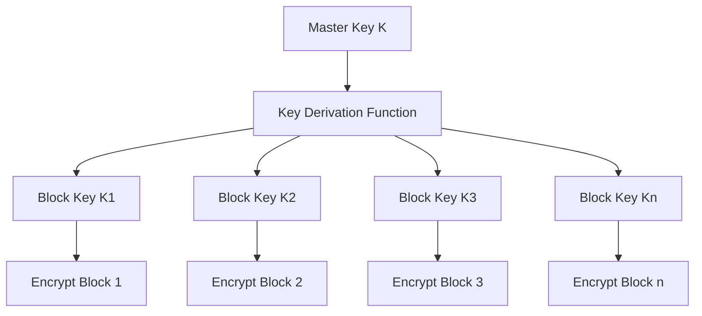

I understand! Here's a clean, GitHub-compatible README.md that uses proper Mermaid syntax and handles all special characters correctly. The diagrams will render on GitHub (they support Mermaid natively).

---

# Fragmented Encrypted Container System (FECS)

## Next-Generation Cryptographic Storage Architecture

---

**[FECS]** is an advanced cryptographic storage system that redefines data security through fragmentation, intelligent obfuscation, and multi-layer protection.

---

## 📌 Executive Summary

**FECS** represents a paradigm shift in secure data storage, introducing a novel approach that combines fragmentation, decentralized identity mapping, and intelligent obfuscation. The system provides enterprise-grade security with military-level resilience against both cryptographic and physical attacks.

---

## 🎯 Core Value Proposition

| Feature | Description |
|---------|-------------|
| ✅ **Unprecedented Security Posture** | Multiple layers of cryptographic protection |
| ✅ **Plausible Deniability** | Indistinguishable decoy blocks for covert operations |
| ✅ **Resilient Recovery** | Dual-header architecture ensures data survival |
| ✅ **Quantum-Resistant Foundation** | Designed with forward-looking cryptographic primitives |
| ✅ **Zero-Trust Architecture** | Every block independently authenticated and verified |

---

## 🏗️ High-Level System Architecture

---

## 🔄 Encryption Flow Diagram

```mermaid
flowchart LR
    subgraph Phase1["Phase 1: Preparation"]
        A[Input File] --> B[Calculate Block Count]
        B --> C[Partition into Blocks]
    end
    
    subgraph Phase2["Phase 2: Identity & Linking"]
        C --> D[Generate Random IDs]
        D --> E[Build Chain Structure]
        E --> F[Derive Per-Block Keys]
    end
    
    subgraph Phase3["Phase 3: Metadata & Encryption"]
        F --> G[Compute Integrity Hashes]
        G --> H[Create Redundant Metadata]
        H --> I[Authenticated Encryption]
    end
    
    subgraph Phase4["Phase 4: Obfuscation"]
        I --> J[Generate Fake Blocks]
        J --> K[Shuffle All Blocks]
        K --> L[Assemble Final Container]
    end
```

---

## 🛡️ Security Layers Overview

---

## 🗂️ Container Structure

---

## 🔐 Decryption & Recovery Flow

---

## 📊 Security vs Performance Analysis

---

## 🔑 Key Management Architecture

---

## 🎯 Use Cases

| Industry | Application | Benefit |
|----------|------------|---------|
| **Financial Services** | Transaction Data Storage | Unprecedented confidentiality |
| **Healthcare** | Patient Records Protection | HIPAA/GDPR compliance ready |
| **Government** | Classified Document Storage | Multi-layer security assurance |
| **Corporate** | Intellectual Property Protection | Plausible deniability for sensitive IP |
| **Research** | Research Data Protection | Secure collaboration capabilities |

---

## 🚀 Key Innovations

### 1. Dynamic Identity Mapping
Each fragment receives a cryptographically secure random identity, breaking sequential patterns and complicating reconstruction attempts.

### 2. Redundant Metadata Architecture
Critical metadata is duplicated across multiple locations, ensuring recovery even in extreme failure scenarios.

### 3. Smart Decoy Generation
Synthetic blocks that are computationally indistinguishable from real data, providing perfect plausible deniability.

### 4. Independent Block Encryption
Each fragment utilizes its own derived encryption key, eliminating single-point-of-compromise vulnerabilities.

### 5. Chain-Based Integrity
Blocks are linked through a verification chain, creating tamper-evident storage with detectable corruption.

---

## 🛠️ Technical Specifications

### Cryptographic Primitives
| Component | Specification |
|-----------|---------------|
| **Hashing** | BLAKE3 / SHA256 |
| **Key Derivation** | HKDF (RFC 5869) |
| **Encryption** | Authenticated Encryption with Associated Data |
| **Randomness** | Cryptographically Secure RNG (CSPRNG) |

### Performance Metrics
| Metric | Value |
|--------|-------|
| **Block Size** | Configurable (64KB - 1MB) |
| **Overhead** | 15-20% (metadata + authentication tags) |
| **Concurrency** | Parallel block processing support |
| **Recovery** | Self-healing capability with redundant metadata |

---

## 🔮 Future Roadmap

- [ ] **Hardware Acceleration** - Optimize for AES-NI and ARM Crypto Extensions
- [ ] **Multi-Cloud Distribution** - Distributed storage across multiple providers
- [ ] **AI/ML Integration** - Intelligent threat detection and adaptive security
- [ ] **Blockchain Integration** - Immutable audit trails for enterprise compliance
- [ ] **Quantum-Safe Transition** - Post-quantum cryptographic primitives

---

## 📬 Connect With Me

### Purn Vadodariya
*Architect & Lead Developer*

---

### 💡 Interested in Learning More?

**FECS** represents the next evolution in cryptographic storage systems. If you're working on:
- Secure data storage solutions
- Next-generation encryption systems
- Privacy-preserving architectures
- Zero-trust security frameworks

### 📧 Contact:
- **Email**: [purnvadodariya57@gmail.com](mailto:purnvadodariya57@gmail.com)
- **LinkedIn**: [Purn Vadodariya](https://www.linkedin.com/in/purnvadodariya)

---

## 📝 Important Note

This document provides a high-level overview of the Fragmented Encrypted Container System. Implementation details, specific algorithms, and core security mechanisms are **not disclosed** to maintain the system's security posture and intellectual property protection.

---

## 📜 License

This technology is protected under intellectual property laws. Inquiries regarding licensing, collaboration, or enterprise adoption can be directed to the contact information above.

---

**[FECS]** - Where Security Meets Innovation

*© 2026 Purn Vadodariya. All rights reserved.*

---
