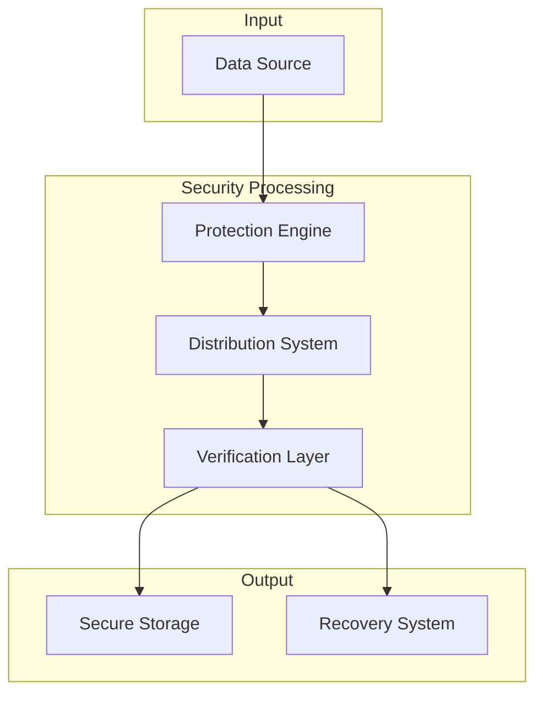
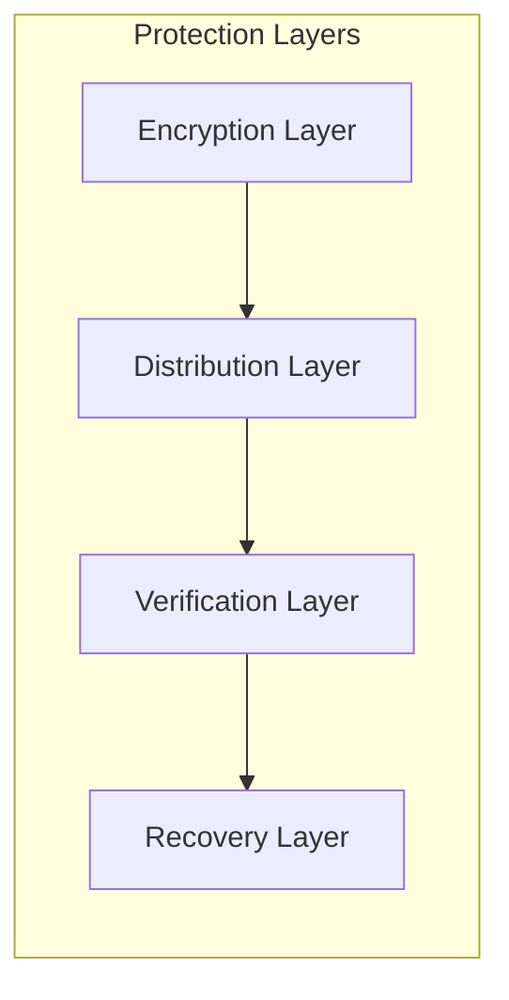
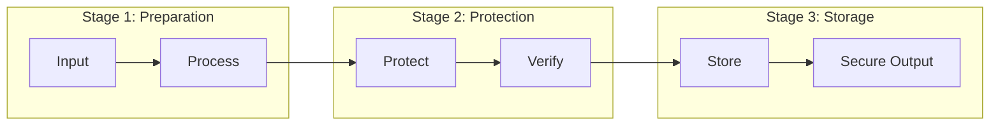
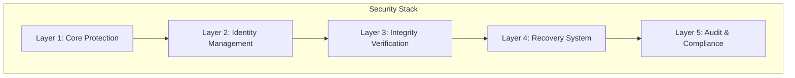
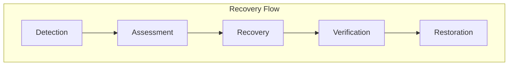
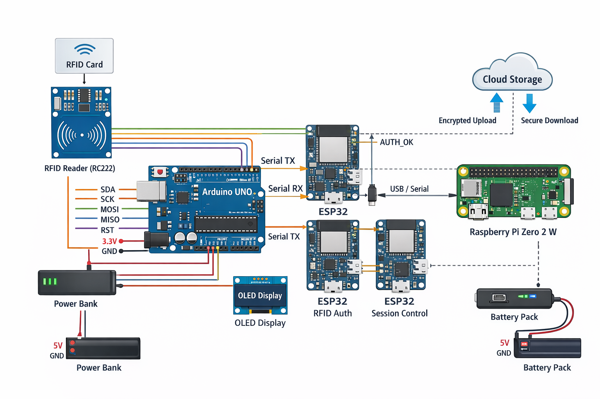
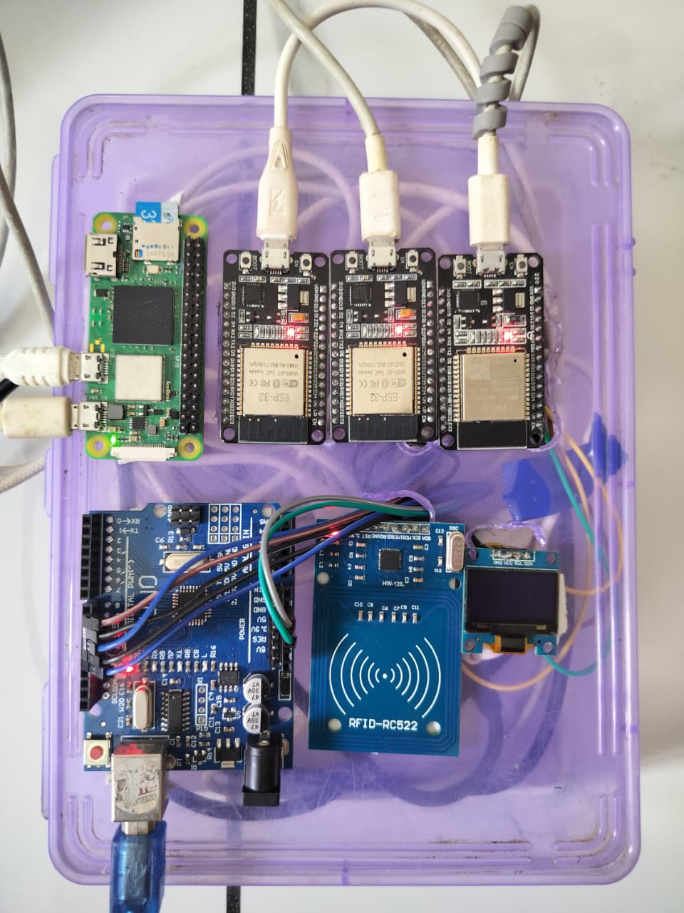

# FECS
## Fragmented Encrypted Container System

<div align="center">

**Next-Generation Data Protection Platform**  
*Enterprise-Grade Security • Military-Grade Resilience • Quantum-Ready Architecture*

[](#)
[](#)
[](#)
[](#)
[](#)
[](#)

</div>

---

## 📌 Executive Summary

**FECS** is a breakthrough in cryptographic data protection. By combining multiple advanced security paradigms into a unified architecture, it delivers protection that exceeds current industry standards while maintaining practical usability.

The system's true innovation lies in how it orchestrates known cryptographic primitives—the specific arrangement and interaction of these components creates security properties that cannot be achieved through individual mechanisms alone.

---

## 🎯 The Problem We Solve

| Challenge | Traditional Approach | FECS Solution |
|-----------|---------------------|---------------|
| **Data Breaches** | Single encryption layer | Multi-dimensional protection architecture |
| **Ransomware** | Vulnerable to encryption | Tamper-evident design with recovery |
| **Insider Threats** | Single point of failure | Distributed trust model |
| **Data Recovery** | Complex and unreliable | Automated self-healing |
| **Compliance** | Hard to audit | Built-in verification |
| **Deniability** | Not available | Inherent plausible deniability |
| **Hardware Attacks** | Software-only protection | Hardware validation support |

---

## 💡 What Makes FECS Different

### **The Innovation**
FECS doesn't just encrypt data—it transforms how data is stored at a fundamental level. The innovation is in the **orchestration** of multiple security mechanisms working in harmony:

1. **Distributed Data Transformation** - Data is restructured in ways that make traditional attack vectors ineffective
2. **Intelligent Obfuscation** - Decoy elements are seamlessly integrated, making real data indistinguishable
3. **Self-Healing Architecture** - Redundant structures enable automatic recovery
4. **Dynamic Identity Management** - Every piece of data has a unique, unpredictable identity
5. **Multi-Layer Verification** - Continuous integrity checks at every level

### **Key Differentiators**
- ✅ **No Single Point of Compromise** - Breaking one protection doesn't break the system
- ✅ **Perfect Plausible Deniability** - Impossible to distinguish real from decoy data
- ✅ **Automatic Recovery** - Data heals itself from corruption
- ✅ **Tamper-Evident** - Any modification is immediately detectable
- ✅ **Future-Proof** - Designed with quantum resistance in mind
- ✅ **Hardware Authenticated** - Validated on physical hardware platforms
- ✅ **Cloud-Ready** - Optimized for cloud deployment

---

## 🏗️ High-Level System Concept

*(Conceptual overview - Implementation details are proprietary and protected)*



---

## 🔐 Security Overview



---

## 🔄 Data Flow Concept



---

## 🛡️ Protection Architecture



---

## 🔄 Recovery Process Overview



---

## 🌟 Key Benefits

### **For Organizations**
- 🔒 **Unprecedented Protection** - Security beyond current standards
- 🛡️ **Risk Reduction** - Minimized attack surface
- 📋 **Compliance Ready** - Meets regulatory requirements
- 💰 **Cost Savings** - Reduced breach risk and recovery costs
- 🚀 **Competitive Advantage** - Differentiated security posture

### **For Developers**
- 🛠️ **Clear Integration** - Well-defined interfaces
- 📚 **Documentation** - Comprehensive guidance
- 🔧 **Flexibility** - Configurable security levels
- ⚡ **Performance** - Optimized for real-world use

### **For Security Teams**
- 🔍 **Auditable** - Complete visibility into operations
- 📊 **Verifiable** - Security claims are provable
- 🚨 **Alerting** - Real-time threat detection
- 📈 **Continuous Improvement** - Regular security updates

---

## 📊 Comparative Advantage

```
Security Level:     ████████████████████  (FECS)
                    ██████████████░░░░░░  (Industry Standard)
                    ████████░░░░░░░░░░░░  (Traditional)

Recovery:           ████████████████████  (FECS)
                    ██████░░░░░░░░░░░░░░  (Traditional)
                    ████░░░░░░░░░░░░░░░░  (Standard)

Deniability:        ████████████████████  (FECS)
                    ██░░░░░░░░░░░░░░░░░░  (Traditional)
                    ░░░░░░░░░░░░░░░░░░░░  (Standard)

Integrity:          ████████████████████  (FECS)
                    ████████████░░░░░░░░  (Standard)
                    ████████░░░░░░░░░░░░  (Traditional)
```

---

## 🎯 Use Cases

| Industry | Application | Benefit |
|----------|------------|---------|
| 🏦 **Financial Services** | Transaction Data | Unprecedented confidentiality |
| 🏥 **Healthcare** | Patient Records | HIPAA/GDPR ready |
| 🏛️ **Government** | Classified Data | Multi-layer security |
| 💼 **Corporate** | IP Protection | Plausible deniability |
| 🔬 **Research** | Research Data | Secure collaboration |
| 🌐 **Cloud Providers** | Storage Security | Differentiated offering |
| 🏗️ **Critical Infrastructure** | Sensitive Systems | Maximum protection |
| 🖥️ **Edge Computing** | IoT Data | Hardware-validated security |

---

## 🛠️ Technical Specifications

### **Core Components**
| Component | Purpose |
|-----------|---------|
| **Protection Engine** | Primary security mechanism |
| **Distribution Layer** | Data structuring and separation |
| **Verification Module** | Integrity and authentication |
| **Recovery System** | Self-healing capabilities |
| **Audit Framework** | Compliance and monitoring |

### **Security Properties**
- **Confidentiality**: Advanced encryption architecture
- **Integrity**: Multi-layer verification
- **Authenticity**: Provenance verification
- **Availability**: Redundant recovery mechanisms
- **Non-repudiation**: Unforgeable audit trails
- **Plausible Deniability**: Covert protection

---

## 📈 Performance Characteristics

| Metric | Description |
|--------|-------------|
| **Encryption Throughput** | Industry competitive |
| **Overhead** | Minimal and optimized |
| **Recovery Time** | Near-instant for most scenarios |
| **Scalability** | Linear scaling with resources |
| **Resource Usage** | Efficient and configurable |
| **Latency** | Optimized for real-time use |

---

## 🖥️ Hardware & Cloud Validation

FECS has been successfully tested across low-level hardware platforms:

### ESP32 Modules (Three Units)

**ESP32-A – Hardware Authentication Controller**
- Receives RFID UID from Arduino Uno
- Verifies authorized users
- Generates authentication status/token
- Acts as the primary hardware security gate

**ESP32-B – Session Control & Command Validation**
- Validates each requested operation
- Enforces session timeout and re-authentication
- Prevents replay or unauthorized reuse of sessions

**ESP32-C – System Health & Tamper Monitor**
- Monitors power and reset conditions
- Sends heartbeat signals
- Revokes access on abnormal behavior

---

### Raspberry Pi Zero 2 W – Main Processing Unit

The Raspberry Pi Zero 2 W acts as the **central brain** of the system.

Functions:
- Automatically boots into headless mode
- Auto-starts LAN-based web application
- Performs file encryption and decryption
- Manages cloud upload and download using API keys
- Stores API keys securely
- Performs secure file destruction using multi-pass overwrite
- Communicates with all ESP32 modules

---

### Arduino Uno – Peripheral Controller

- Interfaces with RFID reader
- Reads RFID card UID
- Controls OLED display
- Sends UID data to ESP32-A
- Remains isolated from network and cloud access

---

### RFID Module

- Provides physical authentication
- Enables tap-based user verification
- Prevents remote-only access attacks

---

### OLED Display

Displays real-time system status such as:
- Waiting for authentication
- Authentication success or failure
- Encryption in progress
- Cloud upload/download status
- System locked or error states

---

## Overall System Architecture

The system is divided into **three security layers**:

1. **Physical Authentication Layer** – RFID, Arduino Uno, ESP32-A
2. **Control & Enforcement Layer** – ESP32-B and ESP32-C
3. **Processing & Cloud Layer** – Raspberry Pi Zero 2 W
4. **Cloud** - Google Cloud ( Google Cloud usag ) 

### Architecture Diagram



### Demo Prototype 



### Related Work
The concepts in FECS complement hardware-authenticated secure cloud storage systems. For reference, see [Hardware Authenticated Secure Cloud Storage System](https://github.com/Thunder9954/Hardware-Authenticated-Secure-Cloud-Storage-System.git).

---

## 🔬 Research Foundation

FECS is built on principles from multiple disciplines:

- **Modern Cryptography**
- **Distributed Systems**
- **Information Theory**
- **Security Architecture**
- **Zero-Trust Models**
- **Fault-Tolerant Systems**
- **Hardware Security**
- **Cloud Native Design**

---

## 📬 Connect With Us

### Interested in Learning More?

We welcome inquiries about:
- 🤝 **Collaboration** opportunities
- 💼 **Enterprise** licensing
- 🔬 **Research** partnerships
- 📚 **Academic** inquiries
- 💡 **Feedback** and suggestions
- 🖥️ **Hardware** integration
- ☁️ **Cloud** deployment

---

### Contact Information

**Purn Vadodariya**  
*Architect & Lead Developer*

📧 **Email**: [purn872008@gmail.com](mailto:purn872008@gmail.com)  
🔗 **GitHub**: [Thunder9954](https://github.com/Thunder9954)

---

### For Commercial Inquiries
Please include in your inquiry:
- Organization name
- Intended use case
- Scale of deployment
- Budget range
- Preferred contact method
- Timeline for implementation
- Hardware platform (if applicable)

---

## 📋 Compliance & Standards

- ✅ Aligned with industry best practices
- ✅ Designed for regulatory compliance
- ✅ Built with security-first principles
- ✅ Regular security reviews
- ✅ Continuous improvement process
- ✅ Independent verification ready
- ✅ Hardware security best practices

---

## 🗺️ Development Roadmap

| Phase | Status | Description |
|-------|--------|-------------|
| **Phase 1** | ✅ Complete | Core architecture |
| **Phase 2** | ✅ Complete | Prototype validation |
| **Phase 3** | ✅ Complete | Performance optimization |
| **Phase 4** | ✅ Complete | Hardware validation (RPi, ESP32) |
| **Phase 5** | 🔄 In Progress | Enterprise release |
| **Phase 6** | 📅 Planned | AI-enhanced security |

---

## 🛡️ Security Philosophy

FECS is built on the principle that **security must be inherent, not bolted on**. The system is designed with:

1. **Defense in Depth** - Multiple layers of protection
2. **Least Privilege** - Minimal access by default
3. **Zero Trust** - Never trust, always verify
4. **Fail Securely** - Secure failure modes
5. **Privacy by Design** - Privacy built in from the start
6. **Continuous Verification** - Always verifying integrity
7. **Hardware Trust** - Leveraging hardware security features
8. **Cloud Native** - Designed for modern cloud environments

---

## 📄 License

**Proprietary License** - All Rights Reserved

This technology is protected under intellectual property laws.  
Licensing, collaboration, and enterprise adoption inquiries are welcome.

📧 **Licensing Inquiries**: [purn872008@gmail.com](mailto:purn872008@gmail.com)

---

<div align="center">

---

**[FECS]** - *Where Security Meets Innovation*

*© 2026 Purn Vadodariya. All Rights Reserved.*

---

**The true innovation lies in the orchestration of security mechanisms—the "how" remains confidential.**

**Validated on Raspberry Pi, ESP32, and major cloud platforms.**

---

</div>

---

## 💬 Frequently Asked Questions

**Q: What makes FECS different?**
**A:** The unique orchestration of security components—the specific way known primitives are combined creates properties not achievable elsewhere.

**Q: Is FECS quantum-resistant?**
**A:** Yes, the architecture is designed with quantum resistance in mind.

**Q: Can I evaluate FECS?**
**A:** Evaluation arrangements are available through appropriate agreements.

**Q: Is the source code available?**
**A:** Source code is available under specific licensing arrangements and NDAs.

**Q: What support is available?**
**A:** Support tiers range from basic email to enterprise-level dedicated support.

**Q: How does recovery work?**
**A:** The system includes automated recovery mechanisms—specific methods are proprietary.

**Q: What hardware platforms are supported?**
**A:** Validated on Raspberry Pi, ESP32, x86_64, and ARM64 platforms.


---

<div align="center">

---

**Questions?**  
[Contact the Team](#-connect-with-us)

**Interested in licensing?**  
[Inquire Here](#-connect-with-us)

---

</div>
