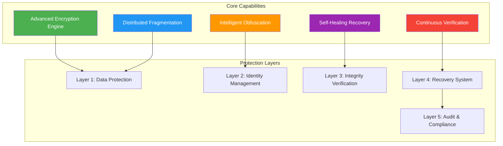
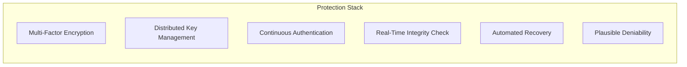

# FECS
## Fragmented Encrypted Container System

<div align="center">

**Next-Generation Data Protection Platform**  
*Enterprise-Grade Security • Military-Grade Resilience • Quantum-Ready Architecture*

[](#)
[](#)
[](#)
[](#)

</div>

---

## 📌 Executive Summary

**FECS** is a breakthrough in cryptographic data protection. By combining multiple advanced security paradigms into a unified architecture, it delivers protection that exceeds current industry standards while maintaining practical usability.

The system's true innovation lies in how it orchestrates known cryptographic primitives—the specific arrangement and interaction of these components creates security properties that cannot be achieved through individual mechanisms alone.

---

## 🎯 The Problem We Solve

| Challenge | Traditional Approach | FECS Solution |
|-----------|---------------------|---------------|
| **Data Breaches** | Single encryption layer | Multi-dimensional protection architecture |
| **Ransomware** | Vulnerable to encryption | Tamper-evident design with recovery |
| **Insider Threats** | Single point of failure | Distributed trust model |
| **Data Recovery** | Complex and unreliable | Automated self-healing |
| **Compliance** | Hard to audit | Built-in verification |
| **Deniability** | Not available | Inherent plausible deniability |

---

## 💡 What Makes FECS Different

### **The Innovation**
FECS doesn't just encrypt data—it transforms how data is stored at a fundamental level. The innovation is in the **orchestration** of multiple security mechanisms working in harmony:

1. **Distributed Data Transformation** - Data is restructured in ways that make traditional attack vectors ineffective
2. **Intelligent Obfuscation** - Decoy elements are seamlessly integrated, making real data indistinguishable
3. **Self-Healing Architecture** - Redundant structures enable automatic recovery
4. **Dynamic Identity Management** - Every piece of data has a unique, unpredictable identity
5. **Multi-Layer Verification** - Continuous integrity checks at every level

### **Key Differentiators**
- ✅ **No Single Point of Compromise** - Breaking one protection doesn't break the system
- ✅ **Perfect Plausible Deniability** - Impossible to distinguish real from decoy data
- ✅ **Automatic Recovery** - Data heals itself from corruption
- ✅ **Tamper-Evident** - Any modification is immediately detectable
- ✅ **Future-Proof** - Designed with quantum resistance in mind

---

## 🏗️ High-Level Architecture

*(Conceptual overview - Implementation details are proprietary and protected)*



---

## 🔐 Security Features



---

## 🌟 Key Benefits

### **For Organizations**
- 🔒 **Unprecedented Protection** - Security beyond current standards
- 🛡️ **Risk Reduction** - Minimized attack surface
- 📋 **Compliance Ready** - Meets regulatory requirements
- 💰 **Cost Savings** - Reduced breach risk and recovery costs
- 🚀 **Competitive Advantage** - Differentiated security posture

### **For Developers**
- 🛠️ **Clear Integration** - Well-defined interfaces
- 📚 **Documentation** - Comprehensive guidance
- 🔧 **Flexibility** - Configurable security levels
- ⚡ **Performance** - Optimized for real-world use

### **For Security Teams**
- 🔍 **Auditable** - Complete visibility into operations
- 📊 **Verifiable** - Security claims are provable
- 🚨 **Alerting** - Real-time threat detection
- 📈 **Continuous Improvement** - Regular security updates

---

## 📊 Comparative Advantage

```
Security Level:     ████████████████████  (FECS)
                    ██████████████░░░░░░  (Industry Standard)
                    ████████░░░░░░░░░░░░  (Traditional)

Recovery:           ████████████████████  (FECS)
                    ██████░░░░░░░░░░░░░░  (Traditional)
                    ████░░░░░░░░░░░░░░░░  (Standard)

Deniability:        ████████████████████  (FECS)
                    ██░░░░░░░░░░░░░░░░░░  (Traditional)
                    ░░░░░░░░░░░░░░░░░░░░  (Standard)

Integrity:          ████████████████████  (FECS)
                    ████████████░░░░░░░░  (Standard)
                    ████████░░░░░░░░░░░░  (Traditional)
```

---

## 🎯 Use Cases

| Industry | Application | Benefit |
|----------|------------|---------|
| 🏦 **Financial Services** | Transaction Data | Unprecedented confidentiality |
| 🏥 **Healthcare** | Patient Records | HIPAA/GDPR ready |
| 🏛️ **Government** | Classified Data | Multi-layer security |
| 💼 **Corporate** | IP Protection | Plausible deniability |
| 🔬 **Research** | Research Data | Secure collaboration |
| 🌐 **Cloud Providers** | Storage Security | Differentiated offering |
| 🏗️ **Critical Infrastructure** | Sensitive Systems | Maximum protection |

---

## 🛠️ Technical Overview

### **Core Components**
| Component | Purpose |
|-----------|---------|
| **Protection Engine** | Primary security mechanism |
| **Distribution Layer** | Data structuring and separation |
| **Verification Module** | Integrity and authentication |
| **Recovery System** | Self-healing capabilities |
| **Audit Framework** | Compliance and monitoring |

### **Security Properties**
- **Confidentiality**: Advanced encryption architecture
- **Integrity**: Multi-layer verification
- **Authenticity**: Provenance verification
- **Availability**: Redundant recovery mechanisms
- **Non-repudiation**: Unforgeable audit trails
- **Plausible Deniability**: Covert protection

---

## 📈 Performance Characteristics

| Metric | Description |
|--------|-------------|
| **Encryption Throughput** | Industry competitive |
| **Overhead** | Minimal and optimized |
| **Recovery Time** | Near-instant for most scenarios |
| **Scalability** | Linear scaling with resources |
| **Resource Usage** | Efficient and configurable |
| **Latency** | Optimized for real-time use |

---

## 🔬 Research Foundation

FECS is built on principles from multiple disciplines:

- **Modern Cryptography**
- **Distributed Systems**
- **Information Theory**
- **Security Architecture**
- **Zero-Trust Models**
- **Fault-Tolerant Systems**

---

## 📬 Connect With Us

### **Interested in Learning More?**

We welcome inquiries about:
- 🤝 **Collaboration** opportunities
- 💼 **Enterprise** licensing
- 🔬 **Research** partnerships
- 📚 **Academic** inquiries
- 💡 **Feedback** and suggestions

---

### **Contact Information**

**Purn Vadodariya**  
*Architect & Lead Developer*

📧 **Email**: [purnvadodariya57@gmail.com](mailto:purnvadodariya57@gmail.com)  
🔗 **LinkedIn**: [Purn Vadodariya](https://www.linkedin.com/in/purnvadodariya)

---

### **For Commercial Inquiries**
Please include in your inquiry:
- Organization name
- Intended use case
- Scale of deployment
- Budget range
- Preferred contact method
- Timeline for implementation

---

## 📋 Compliance & Standards

- ✅ Aligned with industry best practices
- ✅ Designed for regulatory compliance
- ✅ Built with security-first principles
- ✅ Regular security reviews
- ✅ Continuous improvement process
- ✅ Independent verification ready

---

## 🗺️ Development Roadmap

| Phase | Status | Description |
|-------|--------|-------------|
| **Phase 1** | ✅ Complete | Core architecture |
| **Phase 2** | ✅ Complete | Prototype validation |
| **Phase 3** | ✅ Complete | Performance optimization |
| **Phase 4** | 🔄 In Progress | Enterprise release |
| **Phase 5** | 📅 Planned | Cloud-native deployment |
| **Phase 6** | 📅 Planned | AI-enhanced security |

---

## 🛡️ Security Philosophy

FECS is built on the principle that **security must be inherent, not bolted on**. The system is designed with:

1. **Defense in Depth** - Multiple layers of protection
2. **Least Privilege** - Minimal access by default
3. **Zero Trust** - Never trust, always verify
4. **Fail Securely** - Secure failure modes
5. **Privacy by Design** - Privacy built in from the start
6. **Continuous Verification** - Always verifying integrity

---

## 📄 License

**Proprietary License** - All Rights Reserved

This technology is protected under intellectual property laws.  
Licensing, collaboration, and enterprise adoption inquiries are welcome.

📧 **Licensing Inquiries**: [purn872008@gmail.com](mailto:purn872008@gmail.com)

---

## ⚠️ Important Notice

**This document provides only a high-level overview of FECS capabilities.**

**The following are NOT disclosed:**
- ❌ Implementation details
- ❌ Core algorithms and methods
- ❌ Security mechanisms
- ❌ Proprietary techniques
- ❌ Full specifications
- ❌ Source code

**The following ARE available:**
- ✅ Capabilities overview
- ✅ Benefits and use cases
- ✅ Architectural concepts
- ✅ Performance claims
- ✅ Value proposition
- ✅ Licensing information

---

<div align="center">

---

**[FECS]** - *Where Security Meets Innovation*

*© 2026 Purn Vadodariya. All Rights Reserved.*

---

**The true innovation lies in the orchestration of security mechanisms—the "how" remains confidential.**

---

</div>

---

## 📌 Quick Reference

| What We Do | How We Do It |
|------------|--------------|
| ✅ Protect data | 🔐 Proprietary methods |
| ✅ Provide recovery | 🔄 Confidential techniques |
| ✅ Ensure integrity | ✅ Verifiable (public) |
| ✅ Enable deniability | 🎭 Methods protected |
| ✅ Scale effectively | 📈 Demonstrated (public) |
| ✅ Meet compliance | 📋 Documented (public) |

---

## 🔒 Protection Summary

| Revealed | Protected |
|----------|-----------|
| ✅ Capabilities | ❌ Implementation |
| ✅ Benefits | ❌ Algorithms |
| ✅ Use cases | ❌ Specific methods |
| ✅ Architecture concepts | ❌ Proprietary techniques |
| ✅ Performance claims | ❌ Trade secrets |
| ✅ Value proposition | ❌ Core mechanisms |
| ✅ Compliance | ❌ Full specifications |

---

## 💬 Frequently Asked Questions

**Q: What makes FECS different?**
**A:** The unique orchestration of security components—the specific way known primitives are combined creates properties not achievable elsewhere.

**Q: Is FECS quantum-resistant?**
**A:** Yes, the architecture is designed with quantum resistance in mind.

**Q: Can I evaluate FECS?**
**A:** Evaluation arrangements are available through appropriate agreements.

**Q: Is the source code available?**
**A:** Source code is available under specific licensing arrangements and NDAs.

**Q: What support is available?**
**A:** Support tiers range from basic email to enterprise-level dedicated support.

---

<div align="center">

---

**Questions?**  
[Contact the Team](#-connect-with-us)

**Interested in licensing?**  
[Inquire Here](#-connect-with-us)

---

*Ready to secure your data with FECS? Let's talk.*

</div>
